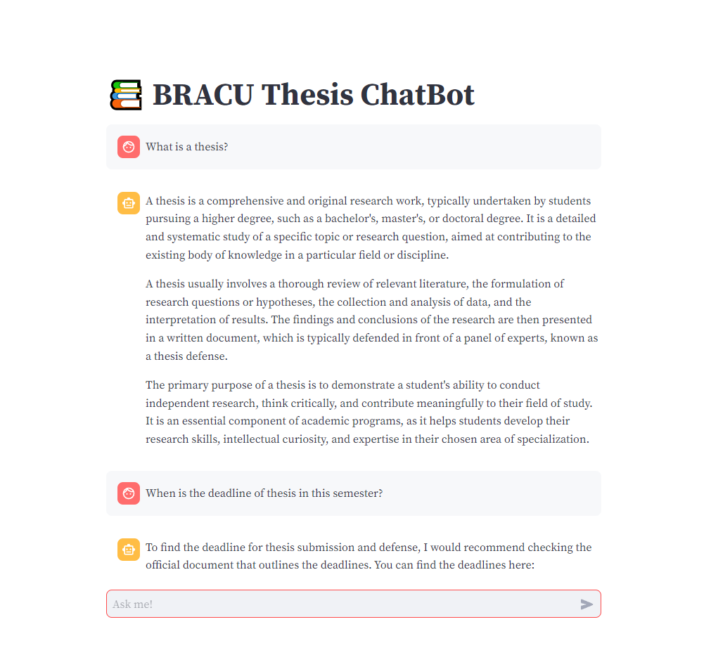
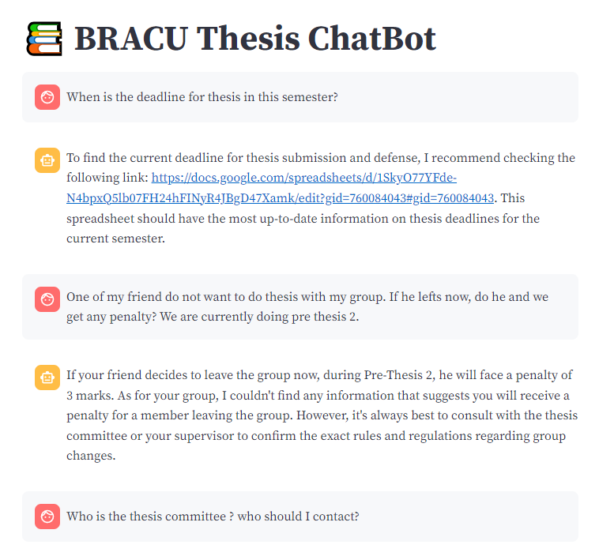
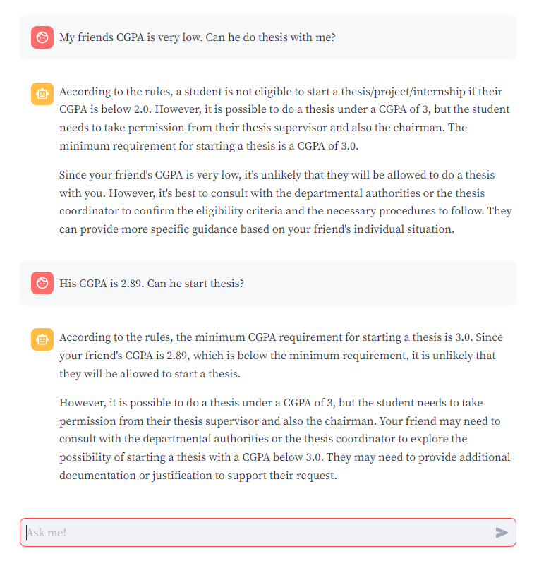

A chatbot that answers queries related to thesis requirements for BRACU students. It was built using Llama 3.3 LLM, ChromaDB as the vector database, and Streamlit for the user interface.

Screenshots:

